<!-- README.md is generated from README.Rmd. Please edit that file -->
# ggpie - A ggplot2 extension to create pie, donut and rose pie plot


[](https://cran.r-project.org/package=ggpie) [](https://cran.r-project.org/package=ggpie)  [](https://github.com/showteeth/ggpie)

## Introduction

`ggpie` aims to create **pie (2D and 3D)**, **donut** and **rose pie** plot with the `ggplot2` plotting system which implemented the grammar of graphics. It contains five main functions:

-   `ggpie`: Create 2D pie plot with single group variable.
-   `ggdonut`: Create 2D donut plot with single group variable.
-   `ggnestedpie`: Create 2D nested pie plot with two group variables.
-   `ggpie3D`: Create 3D pie plot with single group variable.
-   `ggrosepie`: Create rose pie plot with single or two group variables.

<hr />

## Installation

You can install the released version of `ggpie` from [CRAN](https://cran.r-project.org/web/packages/ggpie/index.html) with:

``` r
install.packages("ggpie")
```

Or install the package via the Github repository:

``` r
# install.package("remotes")   #In case you have not installed it.
remotes::install_github("showteeth/ggpie")
```

<hr />

## Usage

### Preapre data

``` r
library(ggpie)
#> Warning: replacing previous import 'lifecycle::last_warnings' by
#> 'rlang::last_warnings' when loading 'tibble'
#> Warning: replacing previous import 'lifecycle::last_warnings' by
#> 'rlang::last_warnings' when loading 'pillar'
library(ggplot2)
data(diamonds)
# check data used
str(diamonds)
#> tibble[,10] [53,940 × 10] (S3: tbl_df/tbl/data.frame)
#>  $ carat  : num [1:53940] 0.23 0.21 0.23 0.29 0.31 0.24 0.24 0.26 0.22 0.23 ...
#>  $ cut    : Ord.factor w/ 5 levels "Fair"<"Good"<..: 5 4 2 4 2 3 3 3 1 3 ...
#>  $ color  : Ord.factor w/ 7 levels "D"<"E"<"F"<"G"<..: 2 2 2 6 7 7 6 5 2 5 ...
#>  $ clarity: Ord.factor w/ 8 levels "I1"<"SI2"<"SI1"<..: 2 3 5 4 2 6 7 3 4 5 ...
#>  $ depth  : num [1:53940] 61.5 59.8 56.9 62.4 63.3 62.8 62.3 61.9 65.1 59.4 ...
#>  $ table  : num [1:53940] 55 61 65 58 58 57 57 55 61 61 ...
#>  $ price  : int [1:53940] 326 326 327 334 335 336 336 337 337 338 ...
#>  $ x      : num [1:53940] 3.95 3.89 4.05 4.2 4.34 3.94 3.95 4.07 3.87 4 ...
#>  $ y      : num [1:53940] 3.98 3.84 4.07 4.23 4.35 3.96 3.98 4.11 3.78 4.05 ...
#>  $ z      : num [1:53940] 2.43 2.31 2.31 2.63 2.75 2.48 2.47 2.53 2.49 2.39 ...
```

<hr />

### Pie plot

#### no label

Pie plot with **no label**:

``` r
# with no label
ggpie(data = diamonds, group_key = "cut", count_type = "full",label_type = "none")
```

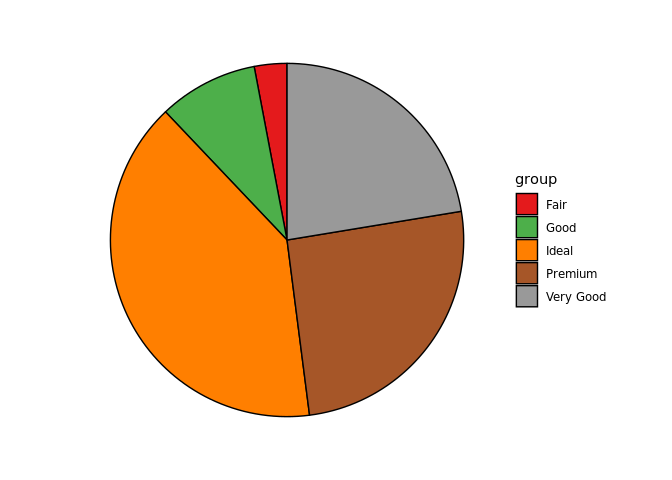

#### circle label

**circle label** and **out** of pie:

``` r
ggpie(data = diamonds, group_key = "cut", count_type = "full",
      label_info = "all", label_type = "circle",
      label_size = 4, label_pos = "out")
```

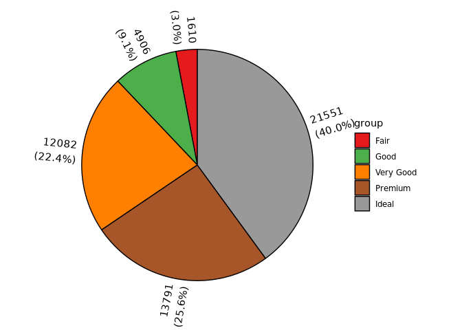

**circle label** and **in** pie plot, with **no split**:

``` r
ggpie(data = diamonds, group_key = "cut", count_type = "full",
      label_info = "all", label_type = "circle", label_split = NULL,
      label_size = 4, label_pos = "in")
```

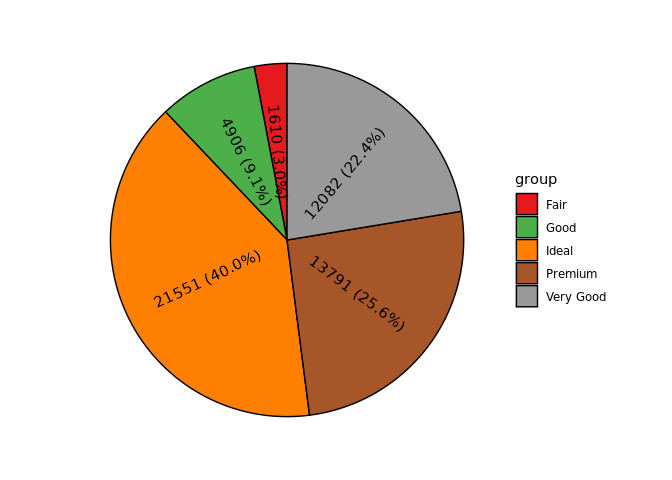

#### horizon label

**horizon label** and **in** pie plot, with **no split**:

``` r
ggpie(data = diamonds, group_key = "cut", count_type = "full",
      label_info = "all", label_type = "horizon", label_split = NULL,
      label_size = 4, label_pos = "in")
```

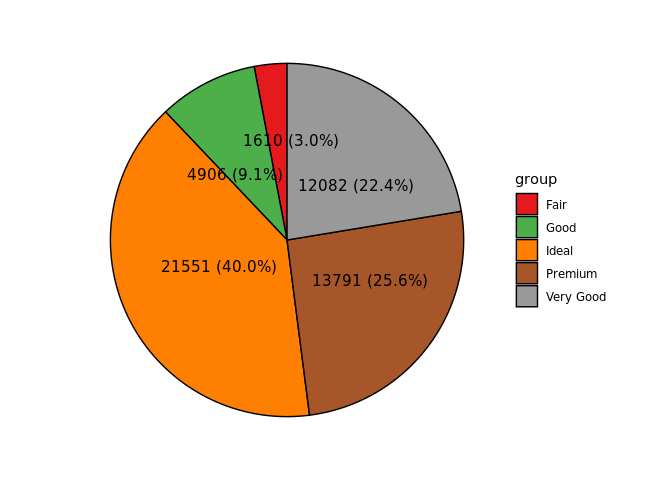

**horizon label** and **in** pie plot, **split with space**:

``` r
ggpie(data = diamonds, group_key = "cut", count_type = "full",
      label_info = "all", label_type = "horizon",
      label_size = 4, label_pos = "in")
```

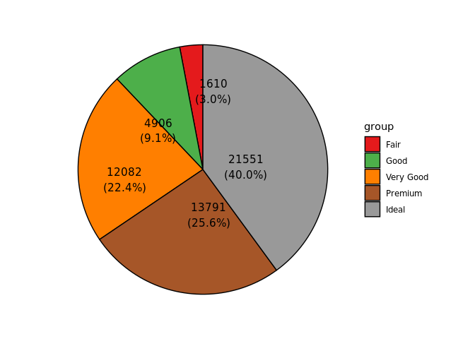

**horizon label** and **out** pie plot, with **no split**:

``` r
ggpie(data = diamonds, group_key = "cut", count_type = "full",
      label_info = "all", label_type = "horizon",
      label_size = 4, label_pos = "out" )
```

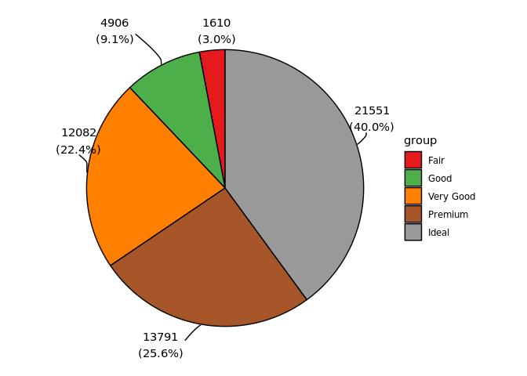

#### adjust threashold

With `labal_threshold`, `ggpie` will move label below `labal_threshold` to out of pie. In this example, all labels below 10% are moved to out of pie:

``` r
ggpie(data = diamonds, group_key = "cut", count_type = "full",
      label_info = "all", label_type = "horizon", label_split = NULL,
      label_size = 4, label_pos = "in", labal_threshold = 10)
```


<hr />

### Donut plot

#### no label

``` r
# with no label
ggdonut(data = diamonds, group_key = "cut", count_type = "full",label_type = "none")
```

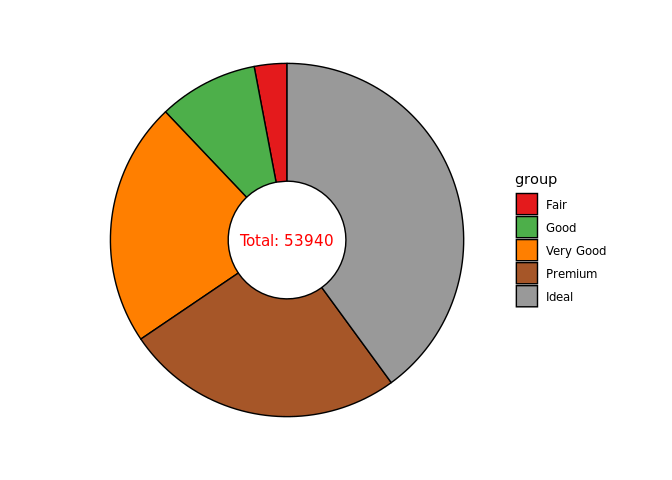

#### circle label

**circle label** and **out** of pie:

``` r
ggdonut(data = diamonds, group_key = "cut", count_type = "full",
        label_info = "all", label_type = "circle",
        label_size = 4, label_pos = "out")
```

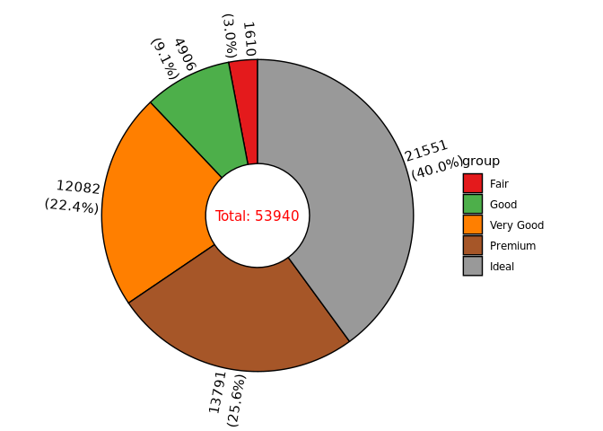

**circle label** and **in** pie plot, with **no split**:

``` r
ggdonut(data = diamonds, group_key = "cut", count_type = "full",
        label_info = "all", label_type = "circle", label_split = NULL,
        label_size = 4, label_pos = "in")
```


#### horizon label

**horizon label** and **in** pie plot, with **no split**:

``` r
ggdonut(data = diamonds, group_key = "cut", count_type = "full",
        label_info = "all", label_type = "horizon", label_split = NULL,
        label_size = 4, label_pos = "in")
```


**horizon label** and **in** pie plot:

``` r
ggdonut(data = diamonds, group_key = "cut", count_type = "full",
        label_info = "all", label_type = "horizon",
        label_size = 4, label_pos = "in")
```

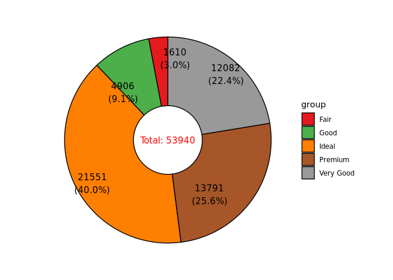

**horizon label** and **out** of pie plot, with **no split**:

``` r
ggdonut(data = diamonds, group_key = "cut", count_type = "full",
        label_info = "all", label_type = "horizon", label_split = NULL,
        label_size = 4, label_pos = "out")
```


**horizon label** and **out** of pie plot:

``` r
ggdonut(data = diamonds, group_key = "cut", count_type = "full",
        label_info = "all", label_type = "horizon",
        label_size = 4, label_pos = "out")
```

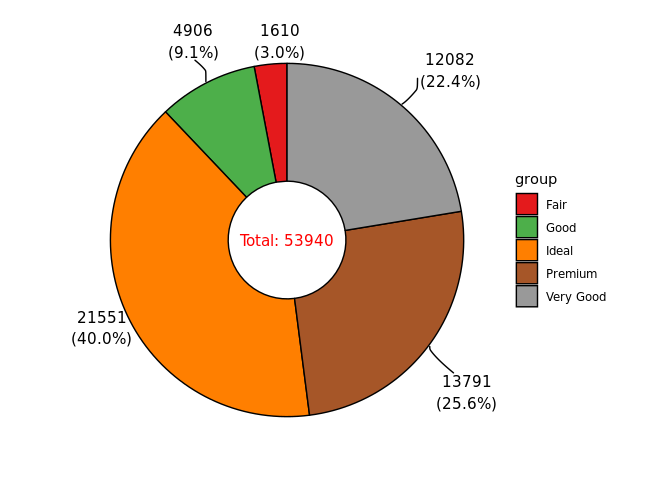

#### adjust threashold

With `labal_threshold`, `ggpie` will move label below `labal_threshold` to out of donut. In this example, all labels below 10% are moved to out of donut:

``` r
ggdonut(data = diamonds, group_key = "cut", count_type = "full",
        label_info = "all", label_type = "horizon", label_split = NULL,
        label_size = 4, label_pos = "in", labal_threshold = 10)
```

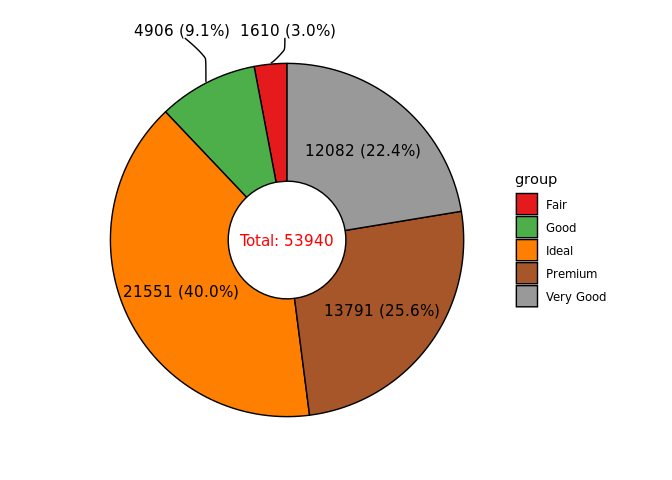

``` r
ggdonut(data = diamonds, group_key = "cut", count_type = "full",
        label_info = "all", label_type = "horizon",
        label_size = 4, label_pos = "in", labal_threshold = 10)
```

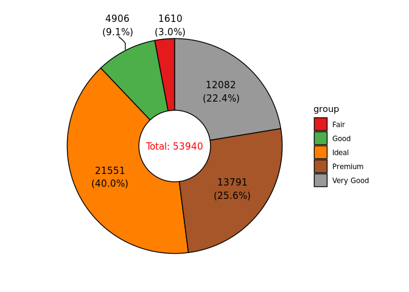

<hr />

### 3D pie plot

``` r
p1= ggpie3D(data = diamonds, group_key = "cut", count_type = "full", tilt_degrees = -10, label_size=2) + 
  ggtitle("tilt_degrees = -10") + 
  theme(plot.title = element_text(hjust = 0.5))

p2= ggpie3D(data = diamonds, group_key = "cut", count_type = "full", tilt_degrees = -40, label_size=2) + 
  ggtitle("tilt_degrees = -40") + 
  theme(plot.title = element_text(hjust = 0.5))

p3= ggpie3D(data = diamonds, group_key = "cut", count_type = "full", tilt_degrees = -10, 
            start_degrees = 60, label_size=2) + 
  ggtitle("start_degrees = 60") + 
  theme(plot.title = element_text(hjust = 0.5))

p4= ggpie3D(data = diamonds, group_key = "cut", count_type = "full", tilt_degrees = -10, 
            start_degrees = 180, label_size=2) + 
  ggtitle("start_degrees = 180") + 
  theme(plot.title = element_text(hjust = 0.5))

cowplot::plot_grid(p1,p2,p3,p4,ncol = 2)
```

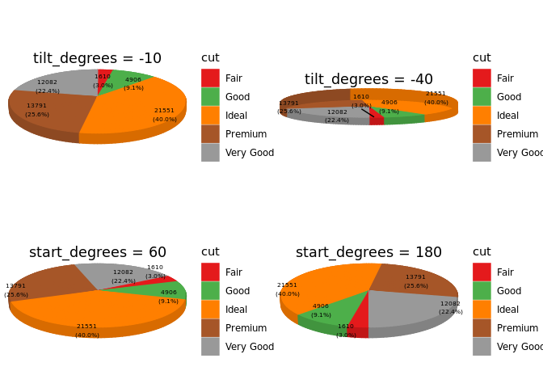

<hr />

### Nested pie/donut plot

It is often the case that we have **two categorical variables** and then need to plot for both of them, `ggnestedpie` is designed to deal with this.

#### inner circle and outer circle

**inner circle label** and **no split**, **outer circle label** and **in** pie plot

``` r
ggnestedpie(data = diamonds, group_key = c("cut", "color"), count_type = "full",
            inner_label_info = "all", inner_label_split = NULL,inner_label_size = 2,
            outer_label_type = "circle", outer_label_pos = "in", outer_label_info = "all")
#> Coordinate system already present. Adding new coordinate system, which will replace the existing one.
```

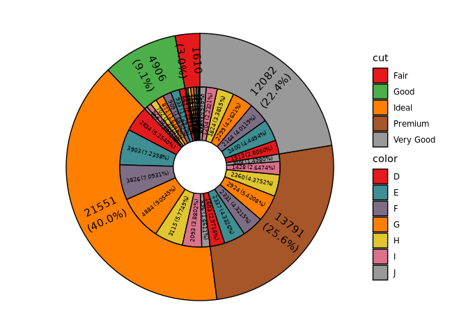

**inner circle label** and **no split**, **outer circle label** and **in** pie plot, **remove fraction below 1 of inner pie**:

``` r
ggnestedpie(data = diamonds, group_key = c("cut", "color"), count_type = "full",
            inner_label_info = "all", inner_label_split = NULL,
            inner_labal_threshold = 5, inner_label_size = 2,
            outer_label_type = "circle", outer_label_pos = "in", outer_label_info = "all")
#> Coordinate system already present. Adding new coordinate system, which will replace the existing one.
```

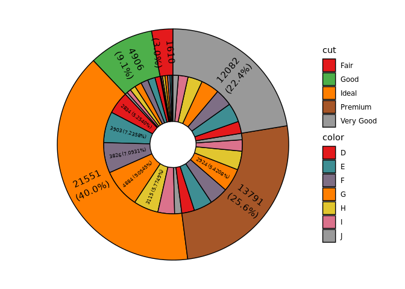

**inner circle label** and **no split**, **outer circle label** and **out** of pie plot:

``` r
ggnestedpie(data = diamonds, group_key = c("cut", "color"), count_type = "full",
            inner_label_info = "all", inner_label_split = NULL, inner_label_size = 2,
            outer_label_type = "circle", outer_label_pos = "out", outer_label_info = "all")
#> Coordinate system already present. Adding new coordinate system, which will replace the existing one.
```

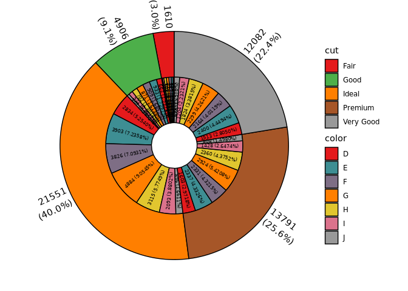

#### inner circle and outer horizon

**inner circle label** and **no split**, **outer horizon label** and **out** of pie plot, **remove fraction below 1 of inner pie**:

``` r
ggnestedpie(data = diamonds, group_key = c("cut", "color"), count_type = "full",
            inner_label_info = "all", inner_label_split = NULL,
            inner_labal_threshold = 1, inner_label_size = 2,
            outer_label_type = "horizon", outer_label_pos = "out", outer_label_info = "all")
#> Coordinate system already present. Adding new coordinate system, which will replace the existing one.
```

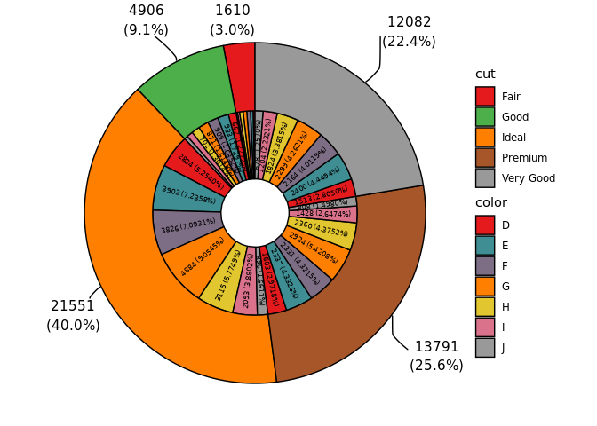

**inner circle label** and **no split**, **outer horizon label** and **in** pie plot, **remove fraction below 1 of inner pie**, **adjust fraction below 10 to out of pie of outer pie plot**:

``` r
ggnestedpie(data = diamonds, group_key = c("cut", "color"), count_type = "full",
            inner_label_info = "all", inner_label_split = NULL,
            inner_labal_threshold = 1, inner_label_size = 2,
            outer_label_type = "horizon", outer_label_pos = "in",
            outer_label_info = "all", outer_labal_threshold = 10)
#> Coordinate system already present. Adding new coordinate system, which will replace the existing one.
```

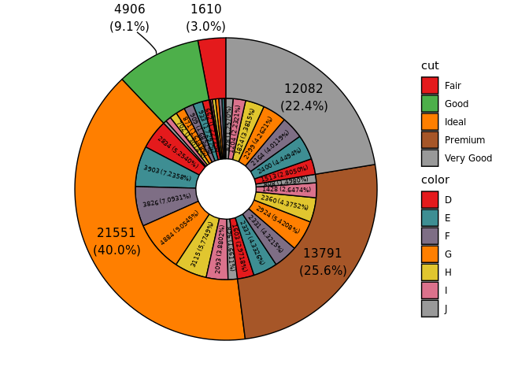

#### blank between plot

``` r
ggnestedpie(data = diamonds, group_key = c("cut", "color"), count_type = "full", 
            r0 = 0.5, r1 = 1.5, r2 = 2.6,inner_label_info = "all", inner_label_split = NULL,
            inner_labal_threshold = 1, inner_label_size = 2,
            outer_label_type = "horizon", outer_label_pos = "in",
            outer_label_info = "all", outer_labal_threshold = 10)
#> Coordinate system already present. Adding new coordinate system, which will replace the existing one.
```

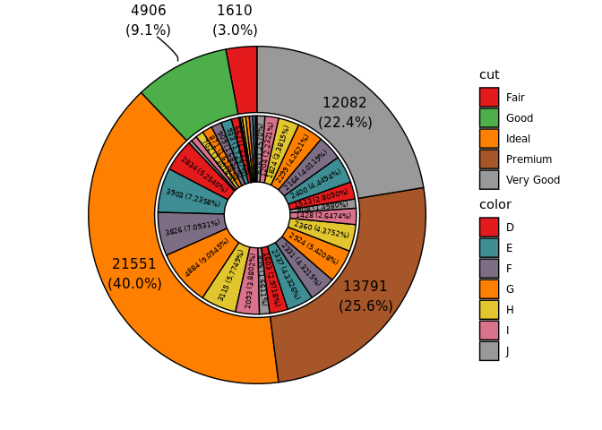

<hr />

### Rose pie/donut plot

#### single variable

**do not show tick**:

``` r
# pie plot
p1=ggrosepie(diamonds, group_key = "color", count_type = "full", label_info = "all",
             show_tick=F,donut_frac=NULL)
# donut plot
p2=ggrosepie(diamonds, group_key = "color", count_type = "full", label_info = "all",
             show_tick=F,donut_frac=0.3,donut_label_size=3)
cowplot::plot_grid(p1,p2)
```

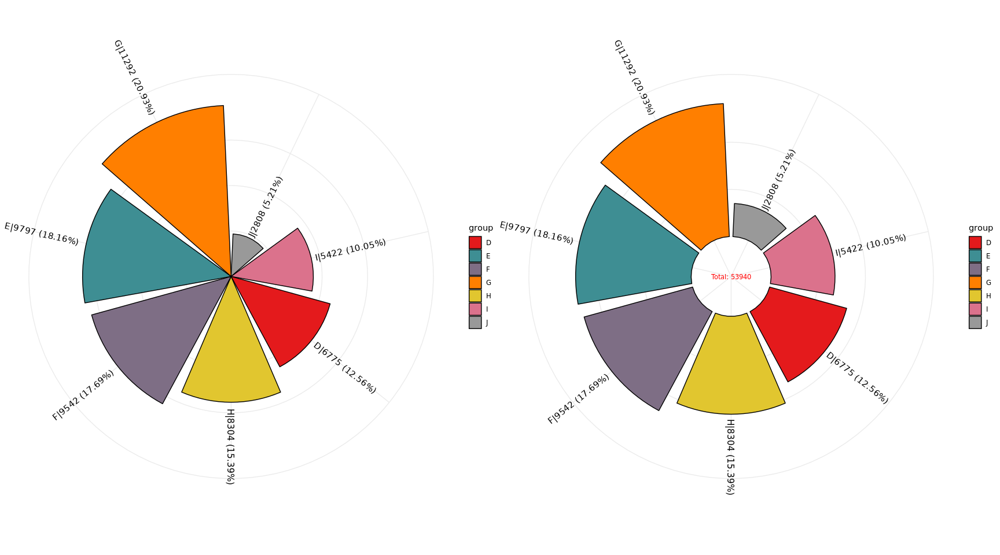

**show tick** and **select breaks automaticly**:

``` r
# pie plot
p1=ggrosepie(diamonds, group_key = "color", count_type = "full", label_info = "all",
             donut_frac=NULL)
# donut plot
p2=ggrosepie(diamonds, group_key = "color", count_type = "full", label_info = "all",
             donut_frac=0.3,donut_label_size=3)
cowplot::plot_grid(p1,p2)
```

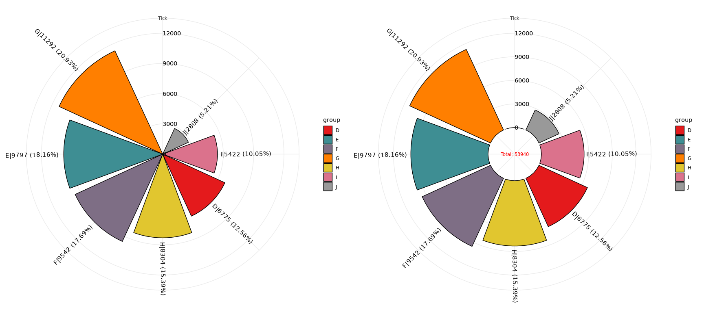

**show tick** and **with specific breaks**:

``` r
# pie plot
p1=ggrosepie(diamonds, group_key = "color", count_type = "full", label_info = "all",
             tick_break = c(3000,5000,7000,11000), donut_frac=NULL)
# donut plot
p2=ggrosepie(diamonds, group_key = "color", count_type = "full", label_info = "all",
             tick_break = c(3000,5000,7000,11000), donut_frac=0.3,donut_label_size=3)
cowplot::plot_grid(p1,p2)
```


#### two variables

**do not show tick**:

``` r
# pie plot
p1=ggrosepie(diamonds, group_key = c("color","clarity"),
             count_type = "full", label_info = "all",
             show_tick=F,donut_frac=NULL)
# donut plot
p2=ggrosepie(diamonds, group_key = c("color","clarity"),
             count_type = "full", label_info = "all",
             show_tick=F,donut_frac=0.3,donut_label_size=3)
cowplot::plot_grid(p1,p2)
```


**show tick** and **select breaks automaticly**:

``` r
# pie plot
p1=ggrosepie(diamonds, group_key = c("color","clarity"),
             count_type = "full", label_info = "all",
             donut_frac=NULL)
# donut plot
p2=ggrosepie(diamonds, group_key = c("color","clarity"),
             count_type = "full", label_info = "all",
             donut_frac=0.3,donut_label_size=3)
cowplot::plot_grid(p1,p2)
```

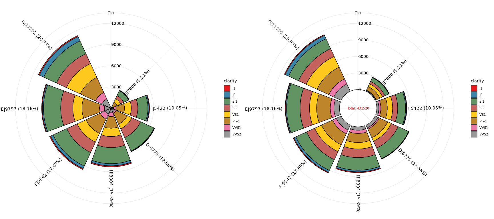

**show tick** and **with specific breaks**:

``` r
# pie plot
p1=ggrosepie(diamonds, group_key = c("color","clarity"),
             count_type = "full", label_info = "all",
             tick_break = c(3000,5000,7000,11000), donut_frac=NULL)
# donut plot
p2=ggrosepie(diamonds, group_key = c("color","clarity"),
             count_type = "full", label_info = "all",
             tick_break = c(3000,5000,7000,11000), donut_frac=0.3,donut_label_size=3)
cowplot::plot_grid(p1,p2)
```


<hr />

## Contributing

Please note that the `ggpie` project is released with a [Contributor Code of Conduct](https://www.contributor-covenant.org/version/1/0/0/code-of-conduct/). By contributing to this project, you agree to abide by its terms.

<br />
